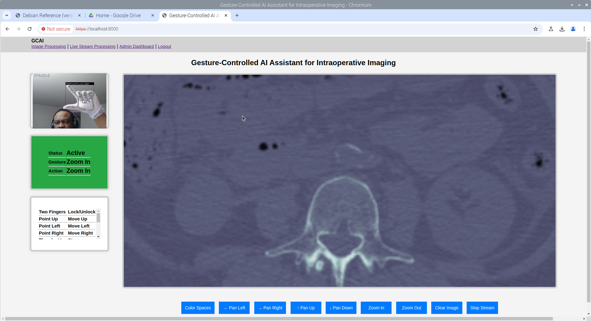
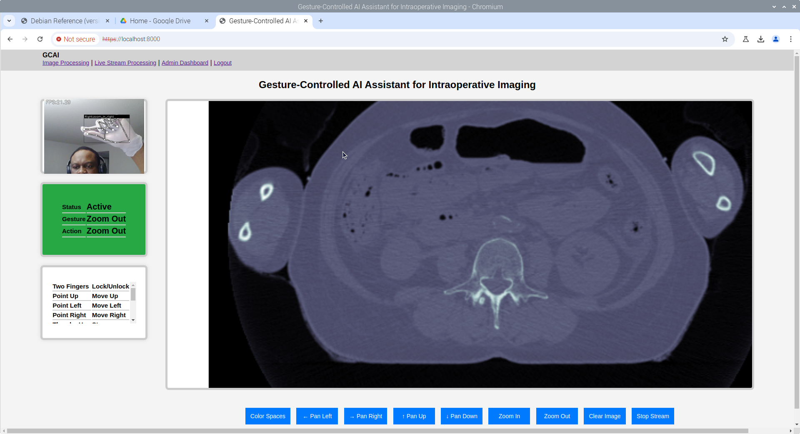

# Hand Gesture Recognition Application

This repository contains a Hand Gesture Recognition application designed for deployment on **Raspberry Pi 5** or other compatible device. The application leverages the **MediaPipe Handlandmarker model** to detect hand landmarks and a custom-trained **TensorFlow Lite** (TFLite) model for gesture classification. It features a **FastAPI backend** and a **JavaScript/HTML/CSS frontend**, offering an intuitive and responsive user interface. Designed and tested on **Linux Debian 12 (Bookworm)**, it supports SSL for secure communication.

---
The application is highly configurable, with environment variables driving its behavior. These variables flow through the application in a modular manner via class inheritance:

1. **`model_setup.py`**  
   Defines the core configurations such as paths, confidence thresholds, and gesture-specific parameters.

2. **`inference.py`**  
   Uses the configurations to manage the hand gesture recognition pipeline, including detection, tracking, and classification.

3. **`main.py`**  
   Orchestrates the FastAPI backend, applying applucable configured settings to power the application's endpoints and real-time inference.

This structure ensures maintainability and scalability.

### Authentication and User Data Management

The **`auth.py`** module handles user creation and authentication. Key functionalities include:

- **User Creation**: Securely stores user credentials.
- **Authentication**: Manages user login and session validation.

The `db_models.py` module is comprised of database models for user managment and database session management.

To get started, user : admin pw : admin is provided for dev environments. **Use more secure passwords and/or password complexity validation for production environments.**

**User management on the front only allows user creation. Full user management, including changing passwords needs further development.**

User data is stored in a persistent **SQLite3** instance (`users.db`) on the device. For **production environments without networking**, it is recommended to periodically back up the `*.db` file. For **networked environments**, more robust storage and authentication mechanisms are suggested to enhance scalability and security where necessary.


### Custom Hand Gesture Model Model Training
 The **`model_training`** folder contains a notebook and some images of experiments tracked using MLFLOW, with NGROK running the front end.

## Features

- **Real-Time Hand Gesture Recognition**
  - Classifies gestures using MediaPipe's 21-point hand landmarks.
  - Supports custom gestures through transfer learning and retraining.

- **Cross-Platform Frontend**
  - Built with JavaScript, HTML, and CSS for a responsive interface.

- **Low Power & Edge Deployment**
  - Optimized for Raspberry Pi 5 with TensorFlow Lite quantized models.
  - Adjustable resolution and confidence thresholds.

- **Touchless Operations (Beta)**
  - Enables control of touchless user interfaces (experimental).

- **Secure & Configurable Backend**
  - Adjustable detection, tracking, and device parameters.
  - SSL-enabled backend for secure local and remote communications.

- **Data Collection and Logging**
  - Configurable modes for capturing and labeling gesture data.

---

## Directory Structure

The locations of several key files and folders/directories is configured via the `startup.sh` file:

- **Virtual Environment Setup**
  - Configurable virtual environment location (e.g. `~/Documents`).
  - Predefined Python environment (e.g. `gcai_prototype`).

- **Application Code**
  - Main application location ( e.g.`~/gcai/main/app`).

- **Models**
  - Keypoint and Point History classifiers stored in the `modelv1` directory.
  - Model versions and paths controlled via environment variables.

- **Frontend**
  - Static files for the web application (HTML, CSS, JavaScript) are hosted by the FastAPI backend.

- **Data Files**
  - Stores keypoint and point history data for training and inference.

---

## Prerequisites

- **Hardware**
  - Raspberry Pi 5.
  - 1 Camera (USB or Raspberry Pi Camera Module) for image transformations, 2 Cameras for Live Video Streaming.

- **Software**
  - Python 3.11.2+
  - TensorFlow runtime.
  - FastAPI and Uvicorn.
  - Modern Google Chrome or Firefox browser for the JavaScript-based frontend.

---

## Installation

1. Clone the repository:
   ```bash
      git clone https://github.com/GCAI-team/gcai-project.git
   ```

2. Set up the virtual environment:
   ```bash
   cd ~/{{your_desired_virtual_env_location}}
   python3 -m venv {{your_desired_virtual_env_name}}
   source {{your_desired_virtual_env_name}}/bin/activate
   ```

3. Install dependencies:
   ```bash
   pip install -r requirements2.txt
   ```
   Or run without versions to try and avoid conflicts 
   
   ```bash
   pip install -r requirements.txt
   ```
 
4. **Optional** but highly recommended. Create self-signed certificates for SSL.
    ```bash
   . create_certs.sh
   ```
   - Additional steps may be needed for macOS or Windows. See create_certs.sh for details.
   - You may use provided certificates, if running locally for development or as a quick start. Use PEM phrase asralicus when prompted.
   - Otherwise, delete the localhost.csr, localhost.crt and localhost.key files and create your own as suggested above.
   
5. Configure environment variables in `startup.sh` as needed.

   **Setting Environment Variables**

        Configure the following environment variables to customize application behavior:

   **Virtual Environment**

            VENV_LOCATION: Path to the virtual environment (e.g., ~/Documents).
            VENV_NAME: Name of the virtual environment (e.g., mediapipe).
            
   **Application Paths**

            APP_FULL_PATH: Full path to the application directory (e.g., ~/gcai/main/app).
            APP_DIR: Relative or full path to the application directory (default: ./).

   **Device Configuration**

            CAP_DEVICE: Index of the camera device (e.g., 0 for the first camera).
            CAP_WIDTH and CAP_HEIGHT: Camera resolution (e.g., 320 and 240).

   **Detection Settings**

            USE_STATIC_IMAGE_MODE: Enable/disable static image mode (e.g., False).
            MIN_DETECTION_CONFIDENCE: Minimum confidence for detections (e.g., 0.9).
            MIN_TRACKING_CONFIDENCE: Minimum confidence for tracking (e.g., 0.5).

   **Gesture Recognition**

            MODEL_VERSION: Version of the TFLite model to load (e.g., 2024_11_24_O).
            NOISE_THRESH: Threshold for filtering gesture noise (e.g., 0.45).

   **Session Management**

            ACCESS_TOKEN_EXPIRE_MINUTES: Token expiry for secure sessions (e.g., 1440).
            INACTIVITY_LIMIT_SEC: Inactivity timeout (e.g., 10).

   **SSL Configuration**

            USE_SSL: Enable/disable SSL (1 for enabled, 0 for disabled).
            SSL_KEYFILE_PATH: Path to the SSL key file.
            SSL_CERTFILE_PATH: Path to the SSL certificate file.

6. Run the application:
   ```bash
   ./startup.sh
   ```
   

7. Access the frontend in your browser:
   - Default URL: [https://localhost:8000/login](https://localhost:8000/login) (if SSL is enabled otherwise use http).
   - Change the port 8000 in startup.sh if needed.

---

## Using the Frontend

The frontend is designed for simplicity and responsiveness:

### Steps to Use:
1. **Launch the Application**  
   Start the backend using the instructions above. Once running, open the frontend in your browser.  
   - Default URL: [https://localhost:8000/login](https://localhost:8000/login) if using SSL,  [http://localhost:8000/login](http://localhost:8000/login)
   - For self signed SSL, a warning might appear about the validity of the SSL certificate. This is because  browsers like Chrome  do not recognize self-signed certificates. 
   You can simply continue running the application over SSL, as this will still be more secure than using the application without it.

2. **Perform Gestures**  
   Show gestures for zooming, panning  gestures in front of the camera. If using two cameras, and the cameras appear mismatched, be sure to set the CAP_DEVICE and CAP_DEVICE2 environment variables appropriately. Use the appropriate command line tool, such as ```v4l2-ctl --list-devices``` to find the camera id on the device. See the gestures document or demo section for more info.

3. **Control Settings**  
   Adjust recognition parameters, such as sensitivity (XY_PX_CHG_PARAM, ZOOM_PCT_CHG_PARAM), confidence levels, or inactivity timeouts, from the startup.sh script. At this point, this will require a restart of  the application.

4. **View Visualizations**  
   The interface will display the detected landmarks and recognized gestures. It includes a live video feed from the connected camera.

### Demo
- **Screenshots**  
  Below are example screenshots of the frontend in action:
  
     
  *Figure 1: Real-time gesture recognition interface (Inference Lock/Unlock)*

    
  *Figure 2: Real-time gesture recognition interface example (Zoom In)*
  
    
  *Figure 3: Real-time gesture recognition interface example (Zoom Out)*

  **Image Citation**
  @data{DVN/3JDZCT_2023,
        author = {McCarville, Alan},
        publisher = {Harvard Dataverse},
        title = {{Visible Human Project CT Datasets Male and Female}},
        year = {2023},
        version = {V1},
        doi = {10.7910/DVN/3JDZCT},
        url = {https://doi.org/10.7910/DVN/3JDZCT}
        }

---

## MediaPipe License

This application incorporates the MediaPipe library, licensed under the [Apache License 2.0](https://www.apache.org/licenses/LICENSE-2.0). 

---

## Future Work

- Enhance dynamic gesture classification.
- Optimize touchless OS operations for broader applications.
- Admin Console for in-session configuration.
- Optimize  streams for live video imaging.
- Modify flows to allow independent live streams between live imaging and inference pipeline.
- Multimodal Capabilities - Voice and Pedal Controls.
- Robust User Management

---

## References

This application incorporates several functionalities and organizational features from the [Kazuhito00/hand-gesture-recognition-using-mediapipe](https://github.com/Kazuhito00/hand-gesture-recognition-using-mediapipe) repository.

---

## License

This project is licensed under the [Apache License 2.0](LICENSE). For details about MediaPipe, refer to its [Apache License 2.0](https://www.apache.org/licenses/LICENSE-2.0).

---

For more details, refer to the comments in the [`startup.sh`](startup.sh) file or raise an issue in this repository.
